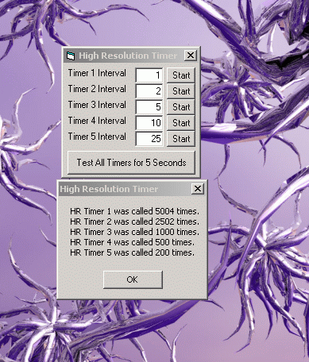



## High Resolution Multimedia Timer API

### Description

Are you tired of VB's inaccurate timer control? Well here is the code for you! This code demonstrates how to use High Resolution Multimedia Timers. With 2 simple API calls you can have a timer that can actually fire 1000 times in a single second instead of VB's timer which can only fire between 50 and 100 times per second. Thanks go out to www.allapi.net, I learned most of what I know about Multimedia Timers from there. If you vote, please leave a comment explaining your vote whether it is a good or bad vote. If you have any improvements or suggestions, please let me know so that I can update it.
 
### More Info
 

             |
---                |---
**Submitted On**   |2002-11-26 11:39:14
**By**             |[¿?¿?](https://github.com/Planet-Source-Code/PSCIndex/blob/master/ByAuthor/empty.md)
**Level**          |Intermediate
**User Rating**    |5.0 (15 globes from 3 users)
**Compatibility**  |VB 6\.0
**Category**       |[Windows API Call/ Explanation](https://github.com/Planet-Source-Code/PSCIndex/blob/master/ByCategory/windows-api-call-explanation__1-39.md)
**World**          |[Visual Basic](https://github.com/Planet-Source-Code/PSCIndex/blob/master/ByWorld/visual-basic.md)
**Archive File**   |[High\_Resol15039211262002\.zip](https://github.com/Planet-Source-Code/high-resolution-multimedia-timer-api__1-41069/archive/master.zip)

### API Declarations

timeSetEvent and timeKillEvent from winmm.dll

